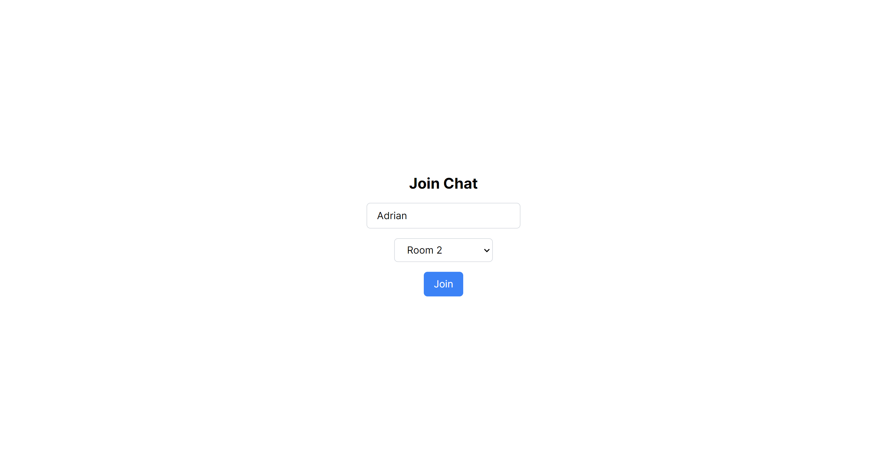
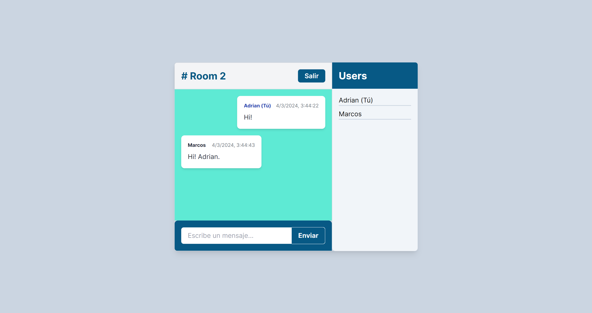

# Sala de Chat en tiempo real con: Next.js, Node.js, Express.js, Socket.io

## Unirse a una sala

## Mensajes de la sala

## Descripción

Esta es una aplicación de salas de chat  en tiempo real construida con Next.js en el frontend, y Node.js y Express.js en el backend. Utiliza Socket.io para la comunicación en tiempo real entre el cliente y el servidor.

## Instalación

Para instalar y ejecutar esta aplicación, sigue estos pasos:

* Clona el repositorio: <code>git clone <https://github.com/adriangrahldev/chat-app-nodejs-express-nextjs.git></code>

* Entra en el directorio del proyecto: <code>cd chat-app-nodejs-express-nextjs</code>

* Instala las dependencias: <code>npm install</code>

* Inicia el servidor de desarrollo: <code>npm run dev</code>

## Uso

Para usar la aplicación, abre tu navegador y ve a <http://localhost:3000>. Podrás unirte a una sala de chat e intercambiar mensajes en tiempo real con otros usuarios.

## Contribución

Las contribuciones son bienvenidas. Por favor, abre un issue o realiza un pull request si deseas contribuir.
